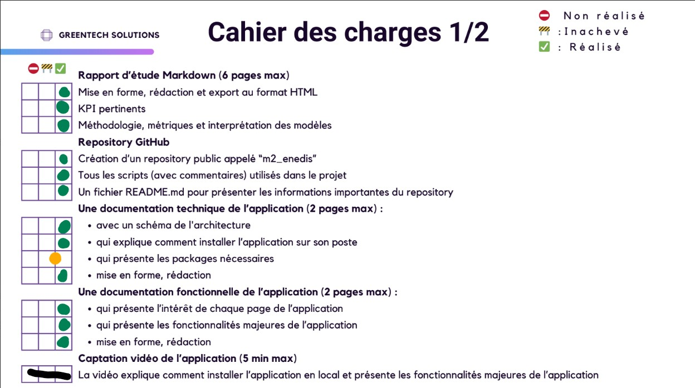
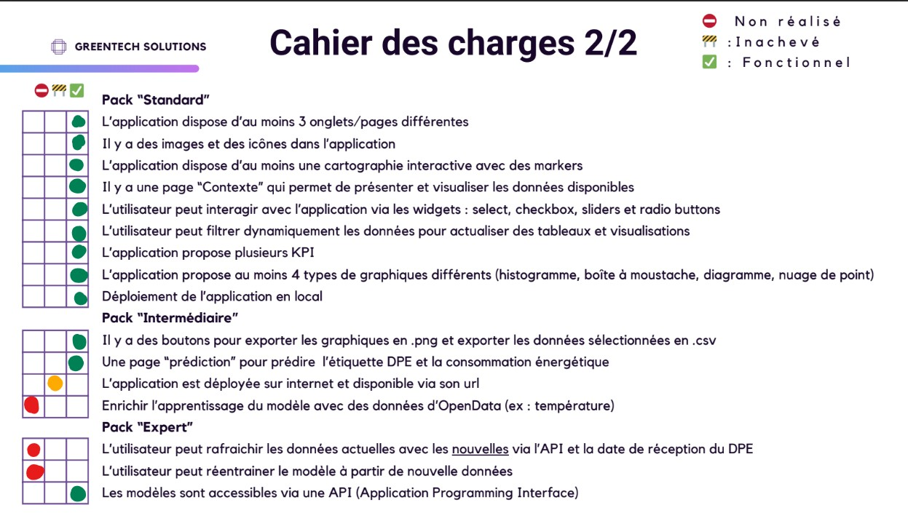

# Projet_ENEDIS — EcoScan Dashboard

Dashboard interactif de prédiction et visualisation de la performance énergétique des logements français (DPE).

> Projet réalisé dans le cadre du Master 2 SISE (Statistique et Informatique pour la Science des données).

---

## Aperçu




---

## Fonctionnalités

- **Analyse descriptive** : graphiques interactifs sur la consommation, le coût énergétique et les émissions CO2
- **Cartographie** : carte interactive des logements par classe DPE et période de construction
- **Prédiction double** :
  - Consommation énergétique (kWh/an) via régression linéaire
  - Classe DPE (A→G) via Random Forest
- **Historique** : sauvegarde des prédictions effectuées
- **Conteneurisé** : Dockerfile inclus pour un déploiement sans configuration

---

## Architecture

```
Interface               APIs Flask             Modèles ML
────────────────        ──────────────         ──────────────────
                        Port 5000         ───► Régression Linéaire
Streamlit (app.py) ────►
                        Port 5001         ───► Random Forest (DPE)
```

---

## Installation

### Prérequis

- Python 3.8+
- (Optionnel) Docker

### Lancement rapide

```bash
# Cloner le repo
git clone https://github.com/Nivrami/Projet_ENEDIS.git
cd Projet_ENEDIS

# Installer les dépendances
pip install -r ml_project/requirements.txt

# Lancer l'application
cd ml_project
streamlit run app.py
```

### Avec Docker

```bash
cd ml_project
docker-compose up --build
```

Puis ouvrir [http://localhost:8501](http://localhost:8501).

---

## Modèles

Les fichiers modèles (`.pkl`, `.joblib`) ne sont pas versionnés. Les placer dans `ml_project/models/` avant de lancer l'application.

---

## Structure du projet

```
Projet_ENEDIS/
├── README.md
├── docs/                          # Documentation et rapports
├── notebooks/                     # Notebooks d'exploration et modélisation
│   ├── 01_nettoyage.ipynb
│   ├── 02_prediction_etiquette.ipynb
│   ├── 03_regression_lineaire.ipynb
│   └── 04_logistic_regression.ipynb
└── ml_project/                    # Application de production
    ├── app.py                     # Point d'entrée Streamlit
    ├── config.py                  # Constantes et configuration
    ├── api_manager.py             # Gestionnaire des APIs
    ├── api_linear_regression.py   # API régression linéaire (port 5000)
    ├── api_random_forest.py       # API Random Forest (port 5001)
    ├── start_app.py               # Script de démarrage
    ├── requirements.txt
    ├── Dockerfile
    ├── models/                    # Modèles ML (non versionnés)
    ├── data/                      # Données (non versionnées)
    ├── img/
    └── views/                     # Pages Streamlit
        ├── contexte.py
        ├── analyse.py
        ├── cartographie.py
        ├── prediction.py
        ├── apropos.py
        └── utils.py
```

---

## Documentation

La documentation technique et fonctionnelle est disponible dans [docs/](docs/).

---

## Équipe

- Miléna GORDIEN-PIQUET
- Marvin CURTY
- Mazilda ZEHRAOUI
